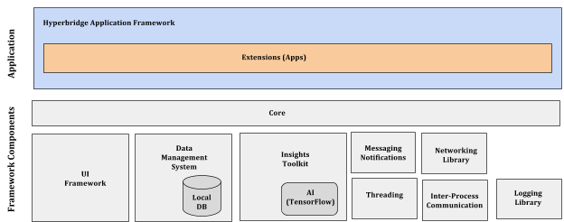
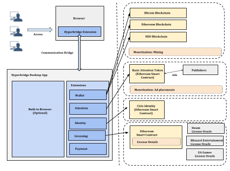
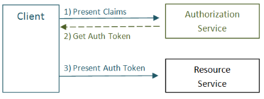

[A Decentralized Blockchain Bridge Ecosystem]{.c11 .c8}

[]{.c16 .c8}

[ Eric Muyser                         Timothy Ko                      
Joe Cullen]{.c23 .c8}

[   ]{.c8 .c26}[<eric@hyperbridge.org>]{.c3 .c26}[          ]{.c8
.c26}[[timothy@hyperbridge.org](mailto:tim@hyperbridge.org){.c5}]{.c3
.c26}[         ]{.c8 .c26}[<joe@hyperbridge.org>]{.c3 .c26}[ ]{.c8 .c26
.c28}

[]{.c8 .c23}

[6th December 2017]{.c8 .c30}

[Working Draft v1.0.1]{.c23 .c8}

[]{.c2}

[Abstract]{.c23 .c6}

[]{.c2}

[        This paper provides an overview of the emerging blockchain
landscape; the problems blockchain seeks to solve; and the issues that
arise related to technical architecture, apps, currencies, and lack of
interoperability between "bordered" networks. In summarizing the current
status and growth trajectory of blockchain: its high level of
decentralization; the rapid and multifaceted market participation; and
the lack of coherence and usability, it becomes obvious that order must
be brought to the chaos.  Hyperbridge is the order, providing coherence
and organization amongst the decentralized blockchain ecosystem. In
essence, Hyperbridge is a platform; a suite of services comprised of an
engine and extensions suited to the seamless navigation and utilization
of a growingly fractured and segmented blockchain atmosphere. A Network
Access Token will be used as a common currency to operate within
Hyperbridge.]{.c2}

[]{.c0}

[Executive Summary]{.c0}

[]{.c0}

[Blockchain is poised to disrupt many industries by taking traditional
centralized databases, with their inherent inefficiencies, and replacing
them with distributed databases that introduce new levels of trust,
transparency and immutability of data.  Organizations around the world
are developing specific blockchain solutions to problems in almost every
industry. This problem-attack model proposes to ameliorate, and in some
cases, eliminate, matters of inefficiency in established and stagnant
industries, such as the ad-buying space and banking, while creating new
interaction models for industries yet unborn, such as the internet of
things (IoT). Democratization has resulted in choice and
decentralization, and has created multiple platforms in which developers
can launch products. ]{.c2}

[]{.c2}

[ETHEREUM, NEO, EOS, and BITCOIN, to name but a few, are unique
blockchains with different value propositions, each clearly
demonstrating utility. While developers tend to make rational and
intelligent choices regarding which platform they use to build upon,
this process has inadvertently resulted in the establishment of borders,
creating blockchain "nation-states" in the process. The issue that
arises from these platforms all serving as coding bases, is that the
access mechanics necessary to interact and develop on these platforms
requires specific computing standards, coding languages and currencies.
]{.c2}

[]{.c2}

[The aforementioned state of blockchain has resulted in a non-unified
environment and an inconvenient participation experience; one that
requires the ownership and management of multiple wallets and currencies
to purchase, hold and utilize tokens on all platforms. Add to the
process a sometimes arduous or costly fiat-to-crypto purchasing
requirement, often through a centralized exchange, then the process
becomes inaccessible to the point of excluding those not intellectually
primed or financially invested in the blockchain sphere.]{.c2}

[]{.c2}

[The non-unified environment also presents issues for developers.
Ongoing participation rates, post ICO, must reach the volume necessary
for full-realization of proposed business models. In short, developers
who are unable to reach and integrate users into their interaction
models will falter. By introducing prospective participants to
blockchains and DAPPs, we will create the market-user condition
necessary for success. ]{.c2}

[]{.c2}

[  Blockchain requires a bridge between users and developers: a
convenient, indexed marketplace and integration platform. Historically,
maximum utility in the market placing of goods and services has been
precipitated by aggregation, and through the convenience brought through
ease of search and transactability.  Think of the internet prior to
search engines and online shopping before Amazon. The network effect is
reliant on a user-base that seeks solutions, and a portal or platform to
connect the seekers and providers of solution. Moreover, as blockchain
is integrated into the established web viewing experience, solutions
will be created to satisfy user concerns related to security and
monetization of data. In this white paper we will detail how we will
achieve this network effect through the creation of a bridging
environment that incentivizes, simplifies, and secures both user
exploration function, as well as developer product showcasing.]{.c2}

[]{.c2}

[]{.c2}

[        ]{.c2}

[]{.c2}

[        ]{.c2}

[]{.c2}

[]{.c2}

[]{.c11 .c8}

[]{.c11 .c8}

[]{.c11 .c8}

[]{.c11 .c8}

[]{.c11 .c8}

[]{.c11 .c8}

[]{.c11 .c8}

[]{.c11 .c8}

[]{.c11 .c8}

[Contents]{.c11 .c8}

[]{.c2}

[[1
Introduction](#h.k8evwgrqtimr){.c5}]{.c6}[        ]{.c6}[[4](#h.k8evwgrqtimr){.c5}]{.c6}

[[1.1 The
Problem](#h.ptf3ammqc60){.c5}]{.c8}[        ]{.c8}[[4](#h.ptf3ammqc60){.c5}]{.c8}

[[1.2 Our
Solution](#h.edvz3heatl5d){.c5}]{.c8}[        ]{.c8}[[5](#h.edvz3heatl5d){.c5}]{.c8}

[[2
Marketplace](#h.vwzlhmcm9xyr){.c5}]{.c6}[        ]{.c6}[[6](#h.vwzlhmcm9xyr){.c5}]{.c6}

[[2.1
Identity](#h.ukaigmyfvdlo){.c5}]{.c8}[        ]{.c8}[[6](#h.ukaigmyfvdlo){.c5}]{.c8}

[[2.2
 Data](#h.kgi69li2zlx8){.c5}]{.c8}[        ]{.c8}[[7](#h.kgi69li2zlx8){.c5}]{.c8}

[[2.2.1
VPN](#h.tlnerex8fnuq){.c5}]{.c8}[        ]{.c8}[[7](#h.tlnerex8fnuq){.c5}]{.c8}

[[2.2.2 Monetization/ Basic
Income](#h.wqrovzr5bezd){.c5}]{.c8}[        ]{.c8}[[7](#h.wqrovzr5bezd){.c5}]{.c8}

[[2.2.3
Attention](#h.nds6n37tv79g){.c5}]{.c8}[        ]{.c8}[[8](#h.nds6n37tv79g){.c5}]{.c8}

[[2.4 Recommendation
Engine](#h.ap0uyehaseve){.c5}]{.c8}[        ]{.c8}[[8](#h.ap0uyehaseve){.c5}]{.c8}

[[2.5 Smart
Home](#h.yijfdpnvz4k0){.c5}]{.c8}[        ]{.c8}[[9](#h.yijfdpnvz4k0){.c5}]{.c8}

[[2.6 License
Management](#h.8faks1k6o2ft){.c5}]{.c8}[        ]{.c8}[[9](#h.8faks1k6o2ft){.c5}]{.c8}

[[3 Proposed
Integrations](#h.es6ndspslxqp){.c5}]{.c6}[        ]{.c6}[[10](#h.es6ndspslxqp){.c5}]{.c6}

[[3.1
Wallets](#h.srw4riftwl36){.c5}]{.c8}[        ]{.c8}[[10](#h.srw4riftwl36){.c5}]{.c8}

[[3.2 Existing Network
Improvements](#h.8ipfphadgub8){.c5}]{.c8}[        ]{.c8}[[10](#h.8ipfphadgub8){.c5}]{.c8}

[[4 Architecture
Overview](#h.38hgs7qfpv00){.c5}]{.c6}[        ]{.c6}[[11](#h.38hgs7qfpv00){.c5}]{.c6}

[[4.1 Network Access
Token](#h.tje5l2r0ezdi){.c5}]{.c8}[        ]{.c8}[[11](#h.tje5l2r0ezdi){.c5}]{.c8}

[[4.2 Application
Framework](#h.f027vztofm4i){.c5}]{.c8}[        ]{.c8}[[12](#h.f027vztofm4i){.c5}]{.c8}

[[4.2.1 Extension
Security](#h.di1w8p4vjbj0){.c5}]{.c8}[        ]{.c8}[[12](#h.di1w8p4vjbj0){.c5}]{.c8}

[[4.2.2 Bytecode
Validation](#h.tjw69hzdzn50){.c5}]{.c8}[        ]{.c8}[[12](#h.tjw69hzdzn50){.c5}]{.c8}

[[4.2.3 Access
Control](#h.10usjkssy6lf){.c5}]{.c8}[        ]{.c8}[[12](#h.10usjkssy6lf){.c5}]{.c8}

[[4.3 Desktop
Application](#h.sbit2az1gf9l){.c5}]{.c8}[        ]{.c8}[[13](#h.sbit2az1gf9l){.c5}]{.c8}

[[4.4 Mobile
Application](#h.usp0cwy1jwzu){.c5}]{.c8}[        ]{.c8}[[13](#h.usp0cwy1jwzu){.c5}]{.c8}

[[4.5 Browser
Extension](#h.d354z2kuj099){.c5}]{.c8}[        ]{.c8}[[14](#h.d354z2kuj099){.c5}]{.c8}

[[4.5.1
Integration](#h.uc9770gpc7sj){.c5}]{.c8}[        ]{.c8}[[14](#h.uc9770gpc7sj){.c5}]{.c8}

[[4.5.2
Commands](#h.w86r6j8myktj){.c5}]{.c8}[        ]{.c8}[[14](#h.w86r6j8myktj){.c5}]{.c8}

[[5 Extension
Development](#h.s3w09nisgji0){.c5}]{.c6}[        ]{.c6}[[14](#h.s3w09nisgji0){.c5}]{.c6}

[[5.1 Extension
Creation](#h.vtwavmt7boqd){.c5}]{.c8}[        ]{.c8}[[14](#h.vtwavmt7boqd){.c5}]{.c8}

[[5.1.1 Resource
Bundle](#h.58bq6hrt384h){.c5}]{.c8}[        ]{.c8}[[15](#h.58bq6hrt384h){.c5}]{.c8}

[[5.1.2 Source
Bundle](#h.fyix8o971n5b){.c5}]{.c8}[        ]{.c8}[[15](#h.fyix8o971n5b){.c5}]{.c8}

[[5.2
Protocol](#h.we7809azv8r3){.c5}]{.c8}[        ]{.c8}[[15](#h.we7809azv8r3){.c5}]{.c8}

[[5.2.1
Commands](#h.mxiezstpuut){.c5}]{.c8}[        ]{.c8}[[15](#h.mxiezstpuut){.c5}]{.c8}

[[5.2.2
Authorization](#h.4z2bok2i8gzr){.c5}]{.c8}[        ]{.c8}[[16](#h.4z2bok2i8gzr){.c5}]{.c8}

[[6 Neur Network
Integration](#h.1otrvur1822q){.c5}]{.c6}[        ]{.c6}[[17](#h.1otrvur1822q){.c5}]{.c6}

[[7 Security
Services](#h.bzvzzht64u2y){.c5}]{.c6}[        ]{.c6}[[17](#h.bzvzzht64u2y){.c5}]{.c6}

[[7.1 Certification
Service](#h.abkm0ffjqjrl){.c5}]{.c8}[        ]{.c8}[[17](#h.abkm0ffjqjrl){.c5}]{.c8}

[[8 Long-Term Technical
Strategy](#h.ene1l8rtlw39){.c5}]{.c6}[        ]{.c6}[[17](#h.ene1l8rtlw39){.c5}]{.c6}

[[8.1 Security
Auditing](#h.qtopow1tsp61){.c5}]{.c8}[        ]{.c8}[[17](#h.qtopow1tsp61){.c5}]{.c8}

[[8.2 Standards
Committee](#h.t07ugrvxhyau){.c5}]{.c8}[        ]{.c8}[[17](#h.t07ugrvxhyau){.c5}]{.c8}

[[8.3 XR
(VR/AR/MR)](#h.kh7k2j9rg21u){.c5}]{.c8}[        ]{.c8}[[18](#h.kh7k2j9rg21u){.c5}]{.c8}

[[9 Existing
Solutions](#h.p22xyrugj08v){.c5}]{.c6}[        ]{.c6}[[18](#h.p22xyrugj08v){.c5}]{.c6}

[[10
Legal](#h.b8e6udtezd1d){.c5}]{.c6}[        ]{.c6}[[18](#h.b8e6udtezd1d){.c5}]{.c6}

[[11
Conclusion](#h.1mof4p3a8sna){.c5}]{.c6}[        ]{.c6}[[18](#h.1mof4p3a8sna){.c5}]{.c6}

[]{.c2}

[]{.c2}

[]{.c2}

[]{.c2}

[]{.c2}

[]{.c2}

[]{.c2} {#h.m3z59tk1hxxt .c18 .c22}
-------

[]{.c2}

[]{.c2}

[1        Introduction]{.c11 .c8} {#h.k8evwgrqtimr .c18}
---------------------------------

### [1.1        The Problem]{.c8 .c16} {#h.ptf3ammqc60 .c17}

[        With ICOs coming to market daily, an increasingly dynamic
blockchain and cryptocurrency atmosphere is providing needed,
industry-wide solutions. As such, investing in innovation has never been
easier (by mid 2017, ICO crowdfunding had outpaced traditional venture
capital]{.c8}^[\[1\]](#ftnt1){#ftnt_ref1}^[), but rapid rate of
investment growth has exceeded user participation. This disparity in
growth rate results in a token value graph that demonstrates a
speculative spike around ICO and a taper downward, to zero in some
cases, as most tokens are not utilized, or as investors reallocate their
investments. There are billions of tokens held and traded but how many
of them are being used for their intended on-network or in-app
purpose?]{.c2}

[]{.c2}

[With some very basic investigation, it is apparent that the original
utility designed into tokens is not currently accessible. In part, this
is due to the absence of user volume, which is necessary to create the
network effects and interactions proposed within projects. At present,
token acquisition and holding are largely speculative, and most tokens
will decline in value because they are not practically useful. Market
value follows market utilization. As such, the token offering landscape
will continue to expand at a rate that creates gradual dilution of value
for most ICOs, as innovations outpace adoptees.]{.c2}

[]{.c2}

[        To achieve the blockchain network effect a coherent ecosystem,
tailored specifically towards the integration of newly arising
technologies, must be developed. In the long-term, as the structural
foundation of data-reliant technologies shifts, blockchain will impact
our everyday lives. In the coming years there are many problems to
solve. Developers have no common marketplace to reach users; similarly,
users have no common marketplace to browse applications.  Broad spectrum
use cases are primed to explode, but users and developers are waiting
 for a platform on which to meet. ]{.c2}

[]{.c2}

[On a macro-level, more support from the broader economy is required,
but commercial interests will not integrate blockchain processes in the
absence of users.  Real world blockchain applications ]{.c2}

### [1.2        Our Solution]{.c16 .c8} {#h.edvz3heatl5d .c17}

[ Tailoring emerging technology to existing solutions is necessary to
increase ease of use and promote adoption. We propose to implement such
an ecosystem, the Hyperbridge ecosystem of blockchain-enabled users.
Finally, there will be a unified point of access for users to view,
search, manage and interact with their blockchain experience, while
seamlessly using the conventional web 2.0 experience they are familiar
with. In addition to the convenience of interacting with blockchain,
users will find themselves empowered for the first time, gaining control
of their attention, data, privacy, and computing power, with the
opportunity to monetize these elements at their discretion. ]{.c2}

[]{.c2}

[By creating the user base, developers will finally have a ready
audience to adopt the solutions they have created, and will create in
the future. On the developer side, we will be providing all necessary
tools and consultation to integrate blockchain and app solutions to our
platform. The gulf between producer readiness and user availability will
be bridged, as there will be a common platform on which to meet, thus
the next era of information will begin.]{.c2}

[]{.c2}

[        We will develop and publish the application ecosystem, herein
named Hyperbridge. It will be available for all major platforms:
Windows, Mac, Android, and iOS. In the future, it is possible to publish
for Xbox, tvOS, Vive, HaloLens, et cetera. In doing so, we will provide
an improved user experience tailored to the operational capacities of
those platforms. ]{.c2}

[]{.c2}

[1.2.1        Platform]{.c16 .c8}

[Hyperbridge will initially launch as a desktop application capable of
augmenting the standard web browsing experience, as well as managing the
blockchain experience. To enable a broad array of functionalities and
use cases we will be engineering a hyper-secure suite of identity and
currency management features. Preloaded features will allow new users to
quickly acclimate and monetize; while seasoned blockchain users will
easily export their wallets and currencies into the app and use it to
manage their blockchain life, whether that be trading, investment,
research, or development. Wallets that hold, transmit and receive tokens
and currencies will be easy to add to user profiles, and several of them
will come preloaded upon download and installation of Hyperbridge.]{.c2}

[]{.c2}

[In addition to a suite of pre-loaded features, the app marketplace will
allow users to create distinct experiences based on their individual
aims. Trading based features such as, price tickers, currency exchange
integrations and news services will be present and installable in the
app marketplace. Features related to data management such as VPN,
user-permissioned data monetization, and monetized ad viewing will also
be available for integration on the marketplace. ]{.c2}

[]{.c2}

[        Though the initial application suite will be built by
Hyperbridge, future application developments will not be exclusively
proprietary, in that outside developers will be incentivized to build
features for the platform. Our primary goal is to create an ecosystem
that enables organizations to bring their blockchain solutions to
market, and in the hands of users. We are building easy to use tools and
specifications for blockchain/app developers that will be integrated
into this ecosystem. Our specifications will be open source, free for
anyone to integrate, re-use and improve. ]{.c2}

[]{.c2}

[]{.c2}

[2        Marketplace]{.c11 .c8} {#h.vwzlhmcm9xyr .c18}
--------------------------------

[]{.c28 .c29 .c39}

[        Our ecosystem is accessible and conducive to third-party
developers, as we actively seeking to build integrations with both
established and emerging players. Because of this dynamic, participatory
and multifaceted environment, there are many possibilities for how users
will design their specific experiences. Our marketplace will function
similarly to the Google Play Store, Xbox Store, et cetera. Users will be
able to purchase/upgrade features, using any supported wallet (initially
Ethereum/Bitcoin). There will be a nominal Network Access Token fee for
these transactions.]{.c2}

[]{.c2}

[With the creation of a highly searchable app marketplace, users will be
able to find, download and integrate applications for their desired use
cases. We will now outline a few of those below.]{.c2}

### [2.1        Identity]{.c16 .c8} {#h.ukaigmyfvdlo .c17}

[        Many of the more valuable use cases provided by emerging
blockchain technology are dependent on reliable identification.
Hyperbridge will support various identity providers (potentially Civic).
Users will be able to add their identity, and apps will be able to
integrate solutions that make use of a secure identity management
protocol (e.g.  for certification or license management) (see
2.6).]{.c2}

### [2.2         Data ]{.c16 .c8} {#h.kgi69li2zlx8 .c17}

[The world is becoming increasingly concerned with privacy, and
awareness for the value of data is at an all time high.  According to
the 2017 Global Consumer Trust
Report]{.c8}^[\[2\]](#ftnt2){#ftnt_ref2}^[, across major countries on 3
continents 86% of consumers had taken various action as a result of
trust concerns.  Since inception, there has been criticism over the way
social networks and services on the Internet collate and monetize data,
but concerns have been largely ignored. Following a rapid rate of
increase in adoption of the services of data collecting entities, the
public is increasingly conscious of securing their data rights.
Companies tend to be averse to implementing data protocols that could
upend their revenue models, and as such responsibility for securing data
rights falls on the user.]{.c2}

[]{.c2}

[Every piece of data a person sends and receives has value, and is
monetized and commodified by some platform or another: be it Google,
Facebook or Twitter. These internet giants make vast sums of money from
your digital footprint, while also putting your security and anonymity
at risk. Hyperbridge will integrate applications that manage access to
data, ensuring that if data is collected and monetized, it is not done
surreptitiously, and that it benefits the originator.]{.c2}

[]{.c2}

[]{.c2}

[]{.c16 .c8}

### [2.2.1 VPN]{.c16 .c8} {#h.tlnerex8fnuq .c18}

[Central to the management of data rights is the notion of privacy. VPNs
are now considered a basic internet security protocol. Beyond the
general implication of data vulnerability related to everyday web
browsing (e.g. banking, communication, entertainment) the high value
nature of crypto-currency necessitates that very stringent protection
mechanisms be in place, as to avoid hacking and theft. Hyperbridge will
integrate secure data tunneling services that ensure information, both
sensitive and innocuous, is protected end to end.   ]{.c2}

[]{.c16 .c8}

### [2.2.2 Monetization/ Basic Income ]{.c16 .c8} {#h.wqrovzr5bezd .c18}

[Due to the current economic framework related to data consumption
versus data creation, a disparity is obvious given that the group that
creates data]{.c8}[,]{.c8 .c31}[ that is then sold to marketers, sees no
economic benefit from the process. As billions of dollars is generated
from the sale of data, compensation is due. Much like privacy has become
a user-responsibility, it is clear that equal data monetization is an
internet right, and must be facilitated from the user end. ]{.c2}

[]{.c2}

[Data collected through Hyperbridge will only be done with the user's
permission, and the sale of that data will directly benefit the user.
]{.c2}

[]{.c2}

[Mining and/or staking of users' computing capacities and coins will
also be implemented at the user's discretions, enabling further
optimization of user's latent capacities for income generation. ]{.c2}

### [2.2.3        Attention        ]{.c16 .c8} {#h.nds6n37tv79g .c17}

[We are now seeing services designed to return the value created through
data to those that have created it. ]{.c2}

[ Attention swapping seeks to replace traditional web advertisements
with ones coming from a blockchain publisher network, such as the Basic
Attention Token (BAT). It will allow users to configure how they would
like advertisements displayed, how often, and how much they would like
to earn on a specific number of impressions. To facilitate a
user-centric experience, Hyperbridge would show, ad view frequency,
history and publisher pool matches.]{.c2}

[]{.c2}

[]{.c2}

[BAT is the first of many potential participants within this space. We
will seek to integrate whomever will benefit users most, striving to
work with those that demonstrate the most potential for market
adoption.]{.c2}

[]{.c2}

### [2.4        Recommendation Engine]{.c16 .c8} {#h.ap0uyehaseve .c18}

[        Currently, there is a lack of interoperability and
communication between entities and organizations, or services, that
house impressions of user profiles and tastes. Going beyond the
inefficiencies that come from having to constantly establish new
profiles as new services emerge, there is a call for a streamlined and
congruent user profile, that maintains user data along a multitude of
channels. The benefits of more permanence and transportability is that
user identity can build and evolve over time versus having to
consistently re-establish tastes and preferences.  In addition, it sets
the user up for more meaningful and targeted marketing engagement.
]{.c2}

[]{.c2}

[In the early 2000s, the way the world consumed music changed
dramatically. People went from physical discs, to completely digital, to
completely online. Many services were created trying to capture this
burgeoning market: Spotify, Rdio, iTunes, Google Play Music, etc.
Shortly after, services were created to analyze and profile music for
their users, so they could keep track and share the music they listen to
and also receive suggestions (e.g. Last.fm, Pandora, etc.). In the last
decade, there has been rapid switching between different services;
however, each time the user loses their data, history, favorites, et
cetera. Each of these services is a black box, and the ones that are not
require custom integration. There is a trust problem within this space.
]{.c2}

[]{.c2}

[A solution to this dysfunction and inconvenience can be solved through
blockchain. If music providers saved data on the blockchain, trusted
services could access  that data to improve customer experience.
Services could analyze recent listening habits across all blockchain
connected services and give better artist suggestions, local concert
ticket sales, new albums in the marketplace, and other ancillary
services. Using Hyperbridge will facilitate this reality. ]{.c2}

[]{.c2}

[        How can this be achieved? Spotify could record listening
history into NEO, while Ticketmaster encodes ticketing history into
Stratis. Hyperbridge would create a transaction on the Ethereum network
that has a reference identifier to the history on both NEO and Stratis,
indicating the person on Spotify also has associated ticket history on
Ticketmaster. It could include granular permission, that the user has
allowed. ]{.c2}

[]{.c2}

[        In the absence of blockchain integration, unique user
preferences and profiles can be set up independently, but will never
achieve the seamlessness and specificity of user experience made
possible through a blockchain enabled recommendation engine. The vision
is to have blockchain function in such a way that effort and
inconvenience is shifted from users to an intuitive recommendation
engine. ]{.c2}

[]{.c2}

[]{.c2}

### [2.5        Smart Home]{.c16 .c8} {#h.yijfdpnvz4k0 .c17}

[        Society is quickly moving towards a persistently connected
Internet of Things (IoT). For nearly every device in existence, somebody
is building connectivity into it. Since Hyperbridge is connected to all
major blockchains and deployed on all major platforms, it is in a unique
position to service as a place to manage and communicate with smart
homes and devices. ]{.c2}

### [2.6        License Management]{.c16 .c8} {#h.8faks1k6o2ft .c17}

[        As technology adoption has grown, and more platforms enter the
space, there has been greater support for multi-platform solutions.
Software and games can now be deployed to Windows, Mac, Xbox,
PlayStation. However, they are still licensed through central
authorities like Microsoft, Sony, EA Games, Valve Corporation, etc.
These authorities issue their own product serial keys, that are not
compatible with other platforms. As a result, consumers are forced to
repurchase the same product on more than one platform. This is another
trust issue, and blockchain is poised to remedy it. Because of issues of
trust between centralized databases, and integration difficulties
between non-standard, cross-platform APIs, license issuing authorities
will not likely communicate with each other to grant product usage on
multiple platforms. With the blockchain, however, they can all operate
with the same shared state, allowing them to service customers who own a
product, even if not purchased through their licensing servers. This
results in more freedom, better options, and savings that are passed
down to consumers. This type of service will be in demand as awareness
spreads and industry leaders are pressured to maintain their competitive
edge over the market.]{.c2}

[]{.c2}

[        Hyperbridge will act as a gateway for the biggest providers in
the license management space, working with these oracles on integrating,
either with our own smart contracts, or through an official partner
offering similar services. These oracles can choose which oracles they
trust to distribute licenses in their Trusted Oracle Group (TOG). We
will also develop an official extension for the application that
supports license management (i.e. digital assets) on the blockchain.
Third-party developers will also be able to create their own extensions
if they wish. ]{.c2}

[]{.c11 .c8} {#h.p63c5ugek5m4 .c18 .c22}
------------

[3        Proposed Integrations]{.c11 .c8} {#h.es6ndspslxqp .c18}
------------------------------------------

### [3.1        Wallets]{.c16 .c8} {#h.srw4riftwl36 .c17}

[Hyperbridge will come with wallet support for Ethereum, and eventually
all major blockchains. Many wallets exist to solve this problem, and
they do the job well enough, but this functionality will need to be
built directly into Hyperbridge to operate effectively. In addition, we
may support existing wallet applications, such as Exodus or Jaxx.]{.c2}

[]{.c2}

[Wallets will have the capacity to auto-detect specific blockchains and
utilize the currencies necessary to operate within the environment.
Trusted wallets on the Hyperbridge network can securely send funds to
each other in ways that avoid the losses incurred in erroneously sending
crypto-currency to non-existent addresses, as Hyperbridge
identity-linked wallets can operate trustlessly.]{.c2}

[]{.c2}

[The following are proposed for near-term integration: Bitcoin,
Ethereum, Litecoin, NEO, Monero, and Ark. See the Roadmap for details on
future development plans.]{.c2}

### [3.2        Existing Network Improvements]{.c16 .c8} {#h.8ipfphadgub8 .c17}

[        Hyperbridge will act as support for specialty networks,
bridging web experiences with the blockchain. Below are some proposed
specialty network bridging use cases.]{.c2}

[]{.c2}

[        GameCredits - Websites can detect if the visitor is
Hyperbridge-enabled, and if so, let the user play a game integrated
within the GameCredits network, enabling connection with their in-game
items and so on. If they are not Hyperbridge-enabled, the website can
suggest they download and install Hyperbridge. Using GameCredits
network, it can save the user\'s progress, achievements, friends and
more, automatically. Game platforms may be able to analyze the player
history and give better recommendations.]{.c2}

[]{.c2}

[        ChainLink - Hyperbridge could act as a frontend for the
ChainLink network, which seeks to provide the backbone of coordinated
oracle services. Such a service would work in tandem with our goal of
improved license management and more.]{.c2}

[]{.c11 .c8} {#h.jmutawro9awg .c18 .c22}
------------

[4        Architecture Overview]{.c11 .c8} {#h.38hgs7qfpv00 .c18}
------------------------------------------

### [4.1        Network Access Token]{.c16 .c8} {#h.tje5l2r0ezdi .c17}

[Hyperbridge will issue an ]{.c8}[[ERC20 standard
token](https://www.google.com/url?q=https://theethereum.wiki/w/index.php/ERC20_Token_Standard&sa=D&ust=1512628005805000&usg=AFQjCNEkSBD18vCiBE1Xx2cZcUh6bdS3CQ){.c5}]{.c3}[ on
the Ethereum network, Network Access Token (NAT). There will be a
limited supply of 1,000,000,000 NAT tokens. Hyperbridge will allow basic
features entirely without NAT, however users will need NAT to access
premium apps and features. ]{.c2}

[]{.c2}

[All precautions will be taken to secure the limited unchanging supply
of NAT. In the unfortunate event of a hack taking place and a
significantly large sum of NAT is stolen, minted, or burned, Hyperbridge
will re-issue the tokens to represent the authentic token state of a
point in history before the hack took place. In the future, it's
possible Hyperbridge will support NAT on more blockchains than Ethereum.
If this is to happen, Hyperbridge will not inflate the number of tokens.
A smart contract would be created for new blockchains, with 0 NAT, and
users will be given a way to convert the NAT they own on Ethereum. At
any one time, there will only ever be 1,000,000,000 tokens across all
blockchains.]{.c2}

[]{.c2}

[NAT will have various uses in the Hyperbridge ecosystem. NAT will be
required for specific operations within the ecosystem, including:]{.c2}

-   [Premium features (such as built-in VPN, mining, etc.)]{.c2}
-   [Unlocking marketplace apps]{.c2}
-   [In-app purchases/upgrades]{.c2}
-   [Publishing apps]{.c2}
-   [Fees from transactions, mining, and other non-basic
    operations]{.c2}

[]{.c2}

### [4.2        Application Framework]{.c16 .c8} {#h.f027vztofm4i .c17}

[]{style="overflow: hidden; display: inline-block; margin: 0.00px 0.00px; border: 0.00px solid #000000; transform: rotate(0.00rad) translateZ(0px); -webkit-transform: rotate(0.00rad) translateZ(0px); width: 624.00px; height: 247.16px;"}

[]{.c2}

[When Hyperbridge boots, it will load installed extensions. These
extensions are notified by the initialization event and given access to
approved capabilities specified by the user.]{.c2}

### [4.2.1        Extension Security]{.c16 .c8} {#h.di1w8p4vjbj0 .c17}

[When extensions are loaded by the app, the bytecode representing them
is scanned to validate they contain no malicious behavior. Additionally,
extensions are limited in what actions they can access in the main
application.]{.c2}

### [4.2.2        Bytecode Validation]{.c16 .c8} {#h.tjw69hzdzn50 .c17}

[Apps are built into bytecode, and thoroughly validated for security
before execution within Hyperbridge. ]{.c2}

### [4.2.3        Access Control]{.c16 .c8} {#h.10usjkssy6lf .c17}

[Of the two main approaches to securing computer systems, the one most
familiar is Access Control Lists (ACL), where the access permissions are
defined on the object in question (e.g. a file) and in terms of defined
agents (e.g. user accounts). The object-capability model turns this on
its head and represents the capability to access a resource as a bearer
token, which itself can be copied and transmitted.]{.c2}

[]{.c2}

[The object-capability model is a computer security model. A capability
describes a transferable right to perform one (or more) operations on a
given object.]{.c2}

[]{.c2}

[Users can manage the capability permissions of extensions. The app will
send an unforgeable reference (uref) message to the extension granting
it the capability of certain objects. For example, the app would send a
message to the Wallets extension, allowing the capability to call the
WalletService objects, add wallet operation.]{.c2}

[]{.c2}

### [4.3        Desktop Application]{.c16 .c8} {#h.sbit2az1gf9l .c17}

[In section 1.2, we introduced our solution, a bridge between existing
products used by millions of users today, like Google Chrome, and the
blockchain world. Below is a diagram showing how the application works
(extension providers still pending):\
]{.c2}

[]{style="overflow: hidden; display: inline-block; margin: 0.00px 0.00px; border: 0.00px solid #000000; transform: rotate(0.00rad) translateZ(0px); -webkit-transform: rotate(0.00rad) translateZ(0px); width: 468.95px; height: 350.91px;"}

[Figure 1:]{.c6}[ Browser communication with the Hyperbridge Desktop
App, which provides connectivity to various blockchains in the
background.]{.c2}

[]{.c2}

[]{.c2}

[]{.c2}

### [4.4        Mobile Application]{.c16 .c8} {#h.usp0cwy1jwzu .c17}

[        Hyperbridge will port the desktop application to mobile,
initially with a subset of features. As there are limitations on mobile
operating systems, Hyperbridge will only be able to support integrations
via ]{.c8}[[Inter-App
Communication](https://www.google.com/url?q=https://developer.apple.com/library/content/documentation/iPhone/Conceptual/iPhoneOSProgrammingGuide/Inter-AppCommunication/Inter-AppCommunication.html&sa=D&ust=1512628005810000&usg=AFQjCNE-nWpJbwxQ9kUoqn5uBdIuw6lc2A){.c5}]{.c3}[ (e.g.
URL scheme appname://hyperbridge). In the case of large data, assuming
the application has gone through proper authentication, it will be given
a reference to the blob of data on the associated blockchain.]{.c2}

[        ]{.c2}

### [4.5        Browser Extension]{.c16 .c8} {#h.d354z2kuj099 .c17}

[        Hyperbridge will automatically detect your browsers and suggest
an associated browser extension to install that will improve the user
experience. Initially it will support Google Chrome, Firefox and
Internet Explorer support will be added in the future. Inversely, the
Hyperbridge Chrome Extension will detect if you have the desktop app
installed, and if not, require the user to install it. The official
Hyperbridge Chrome extension only pipes data to the desktop app, and as
such does not do any processing.]{.c2}

[]{.c2}

### [4.5.1        Integration]{.c16 .c8} {#h.uc9770gpc7sj .c17}

[Apps will be able to integration into the Hyperbridge ecosystem in 3
ways:]{.c2}

1.  [Official Hyperbridge extension]{.c2}
2.  [Website (via a Hyperbridge-enabled browser)]{.c2}
3.  [Inter-App Communication]{.c2}

[]{.c2}

[All of these integrations will use a standard API (defined in
5.2).]{.c2}

[]{.c2}

### [4.5.2        Commands]{.c16 .c8} {#h.w86r6j8myktj .c17}

[        The Chrome extension will send commands to the desktop app,
which will figure out which extensions need to know about them and have
permission to know about them. The extension\'s OAuth token will be
checked to see if it has permission to access that command.]{.c2}

[]{.c2}

[Please see Section 5.2.1 for more information.]{.c2}

[]{.c2}

[5        Extension Development]{.c11 .c8} {#h.s3w09nisgji0 .c18}
------------------------------------------

[        Organizations and independent developers will be provided tools
to develop custom extensions for the application ecosystem.]{.c2}

[]{.c2}

### [5.1        Extension Creation]{.c16 .c8} {#h.vtwavmt7boqd .c17}

[         There are 3 types of extensions that can be uploaded:]{.c2}

1.  [Official Hyperbridge extension bundle]{.c2}
2.  [Website Hyperlink]{.c2}
3.  [App Schema Hyperlink]{.c2}

[]{.c2}

[To build an official Hyperbridge extension, developers will need to
download the development tools for the Windows or Mac operating system.
The Extension Starter Kit comes with all the tools needed to start
building a Hyperbridge Extension (See 3.2). Extensions are written in
C\# (currently 4.6), although C/C++ could be compiled into a shared
dynamically linked library (DLL) to be used as well. The starter kit
includes a customizable build pipeline for exporting extensions used in
Hyperbridge. Each extension has 1) the resources bundle and 2) the
compiled source bundle. After the extension has been created, it can be
uploaded to the blockchain using the tool provided. Alternatively, we
will provide instructions for uploading directly to the blockchain
manually.]{.c2}

### [5.1.1        Resource Bundle]{.c16 .c8} {#h.58bq6hrt384h .c17}

[        Hyperbridge Development Environment will include assets you can
reference in your extensions, and you will be able to include your own
custom assets as well.]{.c2}

### [5.1.2        Source Bundle]{.c16 .c8} {#h.fyix8o971n5b .c17}

[        ]{.c8}[[Hyperbridge Starter
Kit](https://www.google.com/url?q=https://github.com/hyperbridge/app-extension-starter-kit&sa=D&ust=1512628005815000&usg=AFQjCNF4Mysfxo1Na3-pmI7CPuwKxQxz5Q){.c5}]{.c3}[ will
compile C\# into an bytecode known as ]{.c8}[[Common Intermediate
Language](https://www.google.com/url?q=https://en.wikipedia.org/wiki/Common_Intermediate_Language&sa=D&ust=1512628005816000&usg=AFQjCNFHw5_7yRB7FVoSH3CmepBrowLfZw){.c5}]{.c3}[ (CIL)
and package it into a source bundle for use in the Hyperbridge
application. This bundle can be loaded into the Hyperbridge application
manually via the filesystem or URI, as well as through the Hyperbridge
Extension Store once published.]{.c2}

### [5.2        Protocol]{.c16 .c8} {#h.we7809azv8r3 .c17}

[The Hyperbridge ecosystem will use the ]{.c8}[[JSON.API
standard](https://www.google.com/url?q=http://jsonapi.org/&sa=D&ust=1512628005817000&usg=AFQjCNEV84NBgDKcI05cAwGE7nA6E464Ow){.c5}]{.c3}[ for
all communication. All commands documentation can be found in the
Hyperbridge API Documentation.]{.c2}

[]{.c2}

[Apps will be able to communicate over this protocol in various ways,
for example:]{.c2}

1.  [Developer builds an official Hyperbridge extension using the
    Hyperbridge Starter Kit, which provides a communication
    library.]{.c2}
2.  [Developer builds a custom app, and uses Inter-App Communication
    with the standard API.]{.c2}
3.  [Developer builds a customer website, and supports
    Hyperbridge-enabled browsers using the Hyperbridge Browser
    Extension.]{.c2}
4.  [Developer builds a custom browser extension, and uses
    ]{.c8}[[Native
    Messaging](https://www.google.com/url?q=https://developer.chrome.com/apps/messaging%23native-messaging&sa=D&ust=1512628005818000&usg=AFQjCNHBYVx6ITNyuyUK6Itc05s9IIaJFg){.c5}]{.c3}[ with
    the standard API.]{.c2}

### [5.2.1        Commands]{.c16 .c8} {#h.mxiezstpuut .c17}

[        Both the desktop app and the extension have a message broker
(also called message bus or message queue) that sends and receives JSON
messages, called commands. This is similar to libraries like RabbitMQ or
ZeroMQ.]{.c2}

[]{.c2}

[Commands will come in from the desktop app and browser extension. The
desktop app will figure out the extension has the permission to know
about the command and pass it along. It uses the extension OAuth token
for the permission check.]{.c2}

[]{.c2}

[Additionally, the desktop app will send commands to the extensions from
time to time. For example, during startup or when the user takes
action.]{.c2}

[]{.c2}

[When the extension receives a command, it deserializes it, and
determines if and what it should do with it. Each command\'s value is an
encoded string of valid JSON API which can be deserialized into C\#
objects.]{.c2}

[]{.c2}

### [5.2.2        Authorization]{.c8 .c37} {#h.4z2bok2i8gzr .c17}

[        Authorization in Hyperbridge will be done with the
]{.c8}[[OAuth protocol
standard](https://www.google.com/url?q=https://en.wikipedia.org/wiki/OAuth&sa=D&ust=1512628005820000&usg=AFQjCNEBwzuCnBunhC20MWoqeh2KCtGjMA){.c5}]{.c3}[.
OAuth allows us to provide secure authorization to Hyperbridge
capabilities to external apps. OAuth is used by leaders in the tech
industry, including Google, Facebook and Apple. The steps for client
authorization are displayed below:]{.c2}

-   [The client presents some claims to the Authorization Service,
    including identity and the id and scope (capability) of the service
    it wants to access.]{.c2}
-   [The Authorization Service checks whether the client is authorized,
    and if so, creates an access token which is returned to the
    client.]{.c2}
-   [The client then presents this access token to the Resource Service
    (the service the client wants to use).]{.c2}
-   [In general, the access token will only let the client do certain
    things. In our terminology, it has been granted a limited set of
    capabilities.]{.c2}

[The above provides an introduction, for further details please
reference the ]{.c8}[[official OAuth
documentation](https://www.google.com/url?q=https://oauth.net/2/&sa=D&ust=1512628005821000&usg=AFQjCNHaMop_YGsfsnSgtuc2shfO_lXtoQ){.c5}]{.c3}[.]{.c2}

[]{.c2}

[]{style="overflow: hidden; display: inline-block; margin: 0.00px 0.00px; border: 0.00px solid #000000; transform: rotate(0.00rad) translateZ(0px); -webkit-transform: rotate(0.00rad) translateZ(0px); width: 393.09px; height: 148.50px;"}

[]{.c2}

[]{.c2}

[6        Neur Network Integration]{.c11 .c8} {#h.1otrvur1822q .c18}
---------------------------------------------

[        Hyperbridge has partnered with NeurSciences LLC to act as an
exclusive entry point to the Neur network through the Neur wallet.  The
Neur wallet will manage:]{.c2}

[]{.c2}

1.  [Cash in all major traded currencies]{.c2}
2.  [Cryptocurrencies, including NeurCoins and NeurTokens]{.c2}
3.  [Bank and Store Credit Cards ]{.c2}
4.  [I.D. Cards. Licenses, Passports  ]{.c2}
5.  [Discount and/or incentive Coupons]{.c2}
6.  [Loyalty, Status Cards, Membership Cards ]{.c2}
7.  [Event Tickets ]{.c2}
8.  [Transit Passes, Transportation Tickets/Boarding Passes ]{.c2}
9.  [Expiration, Appointment and Event Calendars]{.c2}

[NeurSciences LLC will hold their ICO in February 2018, Hyperbridge will
receive proceeds from the ICO to enable the integration of Neur. ]{.c2}

[7        Security Services]{.c11 .c8} {#h.bzvzzht64u2y .c18}
--------------------------------------

### [7.1        Certification Service]{.c16 .c8} {#h.abkm0ffjqjrl .c17}

[        Hyperbridge Technology Inc. will offer certification for
entities interested in bridging with our ecosystem. Certification will
give users confidence in the authenticity and security of the provider's
app. Contact ]{.c8}[<partners@hyperbridge.org>]{.c3 .c24}[ for more
information on this service.]{.c2}

[]{.c2}

[8        Long-Term Technical Strategy]{.c8 .c11} {#h.ene1l8rtlw39 .c18}
-------------------------------------------------

### [8.1        Security Auditing]{.c16 .c8} {#h.qtopow1tsp61 .c17}

[        We will undergo regular security audits for the Hyperbridge
software. We will use TLA+ software to run exhaustive testing and
verification against our systems. ]{.c2}

### [8.2        Standards Committee]{.c16 .c8} {#h.t07ugrvxhyau .c17}

[        A committee of the leaders in the blockchain and related
technology space will be formed to oversee the progress of the open
source specifications. We will work closely with regulatory and standard
bodies, including but not limited to ISO, IEC, and W3C.]{.c2}

### [8.3        XR (VR/AR/MR)]{.c16 .c8} {#h.kh7k2j9rg21u .c17}

[        Hyperbridge foresees great applications of the blockchain in
the mixed reality space, and intends to be proactive. Hyperbridge can
already be built for Virtual Reality, Augmented Reality, and Mixed
Reality; however, it is not currently our focus to support such
development officially. Eventually users will be able to connect their
blockchain realm into their everyday life in the form of a heads-up
display (HUD).]{.c2}

[9        Existing Solutions]{.c11 .c8} {#h.p22xyrugj08v .c18}
---------------------------------------

[Hyperbridge is not currently aware of any similarly positioned players
in the blockchain space. In the technology world, Hyperbridge takes a
unique approach not yet offered.]{.c2}

[]{.c2}

[10        Legal]{.c11 .c8} {#h.b8e6udtezd1d .c18}
---------------------------

[             The Hyperbridge Network Access Token represents a
tokenized license for interaction with Hyperbridge Technology Inc's
commercial platform services. A Network Access Token does not represent
ownership or equity in any company and as such should not be considered
for potential increase in value, but rather for its utility value as
described in the Hyperbridge Whitepaper.]{.c2}

[]{.c2}

[11        Conclusion]{.c11 .c8} {#h.1mof4p3a8sna .c18}
--------------------------------

[        Hyperbridge will be the transformative user and developer
platform, bringing blockchain to the masses. As an application
ecosystem, marketplace, management environment and developer toolkit,
Hyperbridge is the unifying element, that the blockchain needs.]{.c2}

[]{.c2}

[        ]{.c2}

[]{.c11 .c8}

[]{.c2}

------------------------------------------------------------------------

[\[1\]](#ftnt_ref1){#ftnt1}[ https://www.cnbc.com/2017/08/09/initial-coin-offerings-surpass-early-stage-venture-capital-funding.html]{.c28
.c29 .c26}

[\[2\]](#ftnt_ref2){#ftnt2}[ https://mobileecosystemforum.com/programmes/consumer-trust/global-consumer-trust-survey-2017/]{.c28
.c26 .c29}

